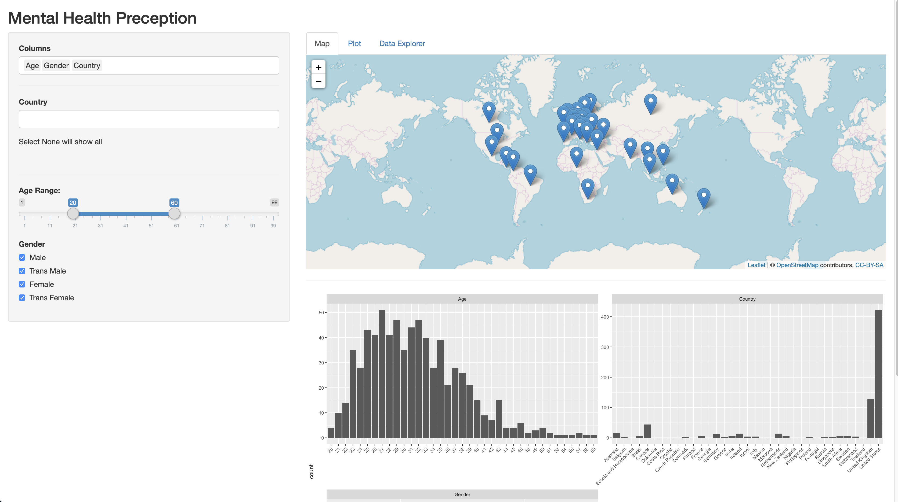
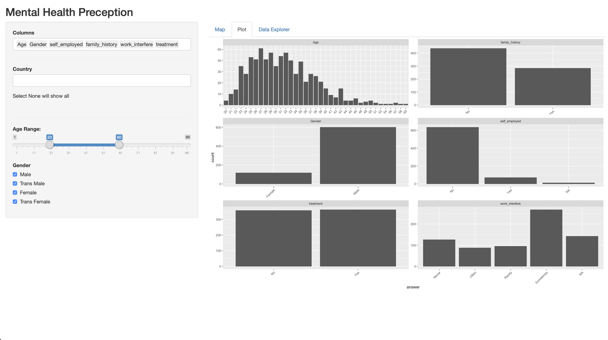
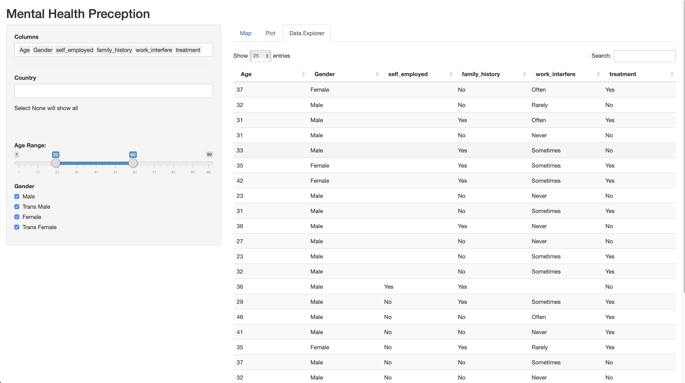

# Milestone 2 report

## Screenshots on Shiny App

## Rationale

Our rationale for the set-up of this app is to allow users to view the data with location and question responses being the main object of interest.
In order to view subsets of the large amount of survey responses when you click on a country, the user is able to see plots below the map based on the country they select.
They can also click on the dropdown list of countries to see multiple countries and view summary statistics for the selected countries in the plot tab. As seen in the screenshots above as the bar graph plots.
Originally we wanted these bar charts of survey responses, age, and gender to show up by hovering over the map, but this took up too much space, and covered the map, so by having it below the map, it is less overwhelming and easier to understand.

## Tasks

The following are the tasks which were completed for Milestone 2:

-   Incorporate geotabs to the country table for mapping.
-   Incorporate dataset to
-   Build a standard ‘filter’ side panel used for each of the ‘Map’, ‘Plot’ and ‘Data Explorer’ tabs.
-   Build ‘Map’ tab
    -   Create a map.
    -   Create plots based on selected country marker on the map by the user.
-   Build ‘Plot’ tab
    -   Create plots based on user selected filters from the ‘filter’ panel.
-   Build ‘Data Explorer’ tab
    -   Raw data based on selected filters from the ‘filter’ panel.
-   Further exploration of features with the team will help confirm which features are most relevant and informative towards the proposal.

## Vision & Next Steps

The goals for milestone 3 are:

-   Narrow down to more relevant features in dataset.
-   Further data wrangling on specific features.
-   Add more themes (color etc) to plots.
-   Address bugs from Milestone 2.

## Bugs

The following bugs will be addressed in Milestone 3.

-   Plots beneath the Map throw an error if there was no 'column'  selected on the filter panel.

    -   Possible cause, there is no mechanism for the plot outputs to handle null 'columns' filters.
    -   Possible solution, to implement an if-else statement to prevent the plot from rendering on null values.

-   Plots beneath the Map throw an error if there no 'country(s)' is/are selected on the filter panel.
    -   Possible cause, there is no mechanism for the plot outputs to handle null 'country' filters.
    -   Possible solution, to implement an if-else statement to prevent the plot from rendering on null values.
-   Plot tab will throws an error if no data is returned from the selected filters.
-   Deselecting columns ‘age’, ‘gender’ and ‘country’ will throw an error on the plot and map tabs.
      o   A solution to allow for data to be filtered in situations where the user does not select the above 3 columns.
