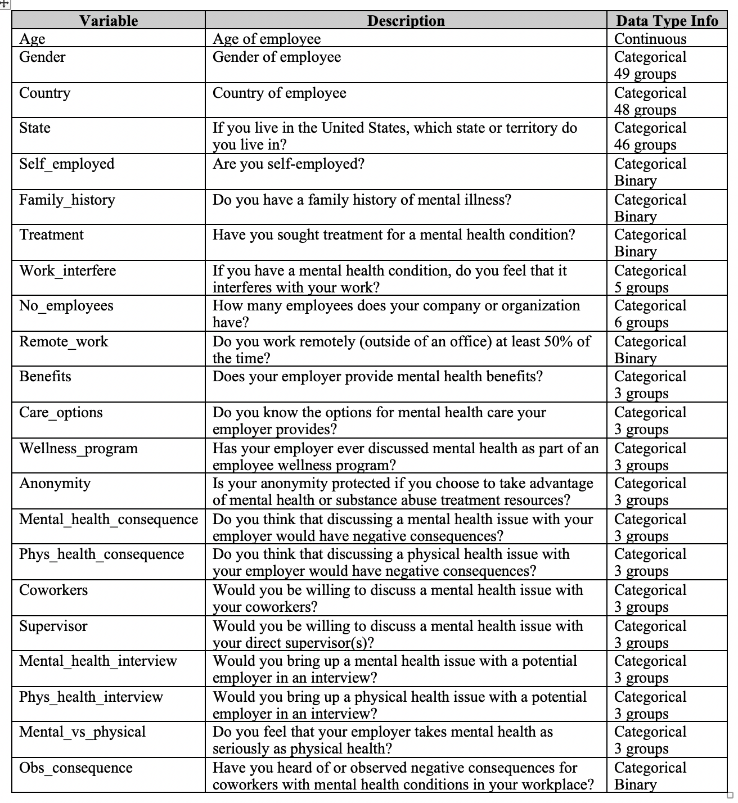

# Milestone 1: Proposal

## Team Members

| Name                | Github.com Username |
| ------------------- | ------------------- |
| Heather  Van Tassel | heathervant         |
| Mike Yuan           | mikeymice           |
| Mani Kohli          | ksm45               |

## Section 1: Overview

This dataset asks people from all over the world working in technology about their opinions on mental health and what kind of options and benefits are available to them through their work. Since participants are from all over the world, the benefits and policies differ along with opinions. Most survey questions are either binary (yes/no) or on a likely scale ranging from often-never and very easy to very difficult. There were 1259 respondents from 48 countries. USA represents 60% of the respondents and the UK is the next largest constituent at 15%. There are some very interesting questions that users will be able to explore with this shiny app. We would like to allow users to explore the question: _How do mental health perceptions differ across genders and countries/states?_ We hope to display this data with a world map and drop-down selections for age, gender, and survey questions, which will allow people to visualize which regions and genders have similar answers to the survey questions which range from how easy it is to get mental health support and their company's mental health benefits, to how comfortable they feel seeking help from employers and talking about mental health issues with their current and potential employers.

Other interesting questions that users may also be able to explore with this app include:

-   How does the size of the company influence whether mental health wellness benefits/programs are accessible?
-   How does working remotely influence mental health opinions?

## Section 2: Description of the data

This [Kaggle](https://www.kaggle.com/osmi/mental-health-in-tech-survey/home) dataset is from a 2014 survey that measures attitudes towards mental health and frequency of mental health disorders in the tech workplace. This survey was completed by 1259 tech employees globally, across 48 countries, and contains responses to primarily 24 categorical variables. The data will be used to visualize interactions related to our proposal.

Raw data:

## Section 3: Usage and scenario tasks

Jessica is an insurance policy analyst tasked with creating policies at a new insurance firm.  Her goal is to strategically implement a mental health policies, which benefit businesses in technology-related industries. Jessica can do this by analyzing various variables by selecting them from the drop-own menu, such as company size and location, which may influence employees' opinions of mental health.  She can ask potential companies to follow up with similar survey questions for their employees to help create optimal health plans, which improve overall employee mental health outcomes. Jessica could also customize policies for companies, by importing different surveys into the shiny app to observe current mental health policy functioning across different geographic locations. If Jessica decides to go above and beyond, she can also integrate this data with global patient health information to identify potential strengths and weaknesses and help further cater insurance policies for new clientele.

Alternatively, as an employee with in the tech industry who is interested about global mental health opinions and benefits may find this app useful when exploring alternative and new places to work. For example, Joe is a computer programmer looking for a new job opportunity which places mental health as a high priority with a positive environment when seeking help. With the help of this shiny app, Joe can search for cities with the highest positive views on mental health as a deciding factor when searching for new work opportunities. 

## Section 4: Description of app

The app has a landing page that shows various visualizations of the data according to the filters and graph type selected. The filters consist of List Box for the feature columns of the interest such as availability of mental health benefits and mental health history. There are Dropdown lists for Countries and States (US only). There will be slider for age selection, and Users can also filter the gender by selecting the Checkbox list.

The data will be displayed as either datatable, bar chart or map. Users can select the graph type by clicking on the corresponding tab.  Figure 1 shows that datatable with description of the data below. The datatable (as shown below) will allow user to examine raw data and search for certain keyword.

Figure 1

The bar chart will show the distribution of each value and provide good comparison between each values, such as how likely workers willing to use mental health benefits. Hovering cursor on each bar will display more values as tooltips.

Figure 2

The map tab will showcase how each each variable distributed in each country. Each pie chart should display the proportion. Hovering cursor on each location should display more values such as total number as tooltips

Figure 3

